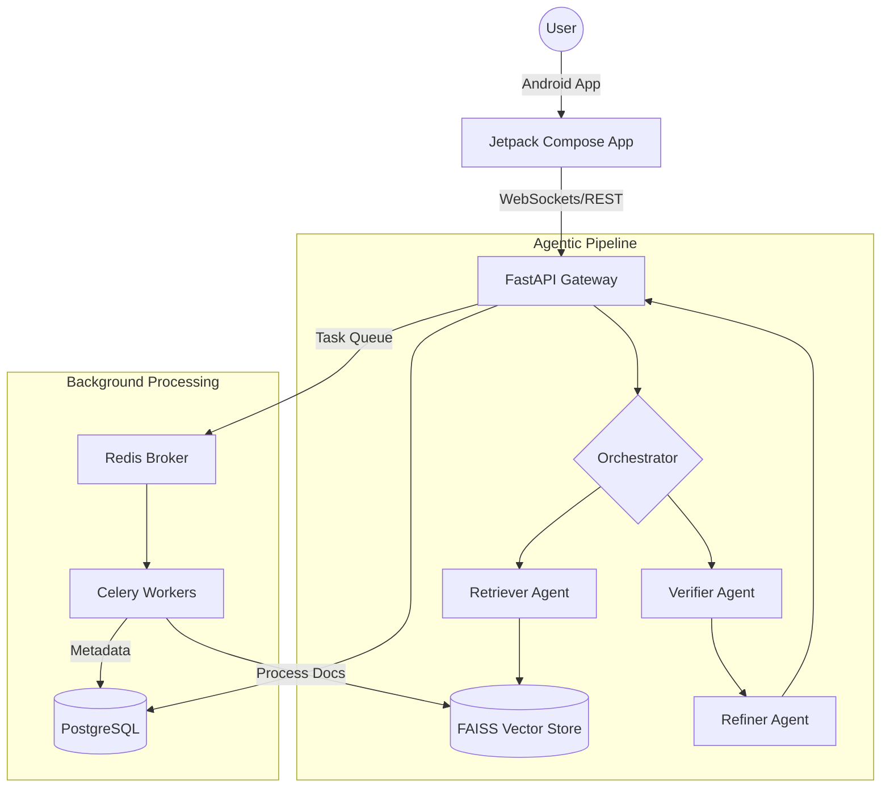

# Scalable Self-Improving Multi-Agent RAG Platform

A **production-grade, end-to-end Retrieval-Augmented Generation (RAG) system** designed for scalability and real-time interaction.
It combines a **multi-agent pipeline**, **asynchronous processing**, and a **native Android frontend** to deliver accurate, context-aware responses that improve over time.

---

## 🎨 High-Fidelity UI Interface

### Desktop Dashboard View
The professional web-based management portal for ingesting documents, monitoring system health, and viewing detailed retrieval analytics.
![AgenticRAG Desktop Dashboard]


### Android Mobile View
The native Jetpack Compose mobile app for real-time, streaming AI chat on the go.
![AgenticRAG Android Mobile]


---

## 🌟 Key Features

* **Multi-Agent Orchestration**:
  A structured pipeline (*Retriever → Verifier → Refiner*) managed by a central orchestrator. Each stage refines the output, ensuring more reliable and high-quality responses.

* **Self-Improving Feedback Loop**:
  Captures user feedback in real time and processes it asynchronously. This helps the system continuously improve retrieval quality and response relevance.

* **Hybrid Semantic Search**:
  Combines **vector-based similarity (FAISS)** with **metadata filtering** to retrieve highly relevant and context-aware information.

* **Asynchronous Processing**:
  Uses **Celery + Redis** to handle heavy tasks like document ingestion, OCR, chunking, and embeddings in the background—keeping the API fast and responsive.

* **WebSocket Streaming**:
  Streams responses token-by-token to the Android app, creating a smooth, real-time “typing” experience similar to modern AI chat systems.

* **Production-Ready Infrastructure**:
  Fully containerized using Docker and designed for deployment on platforms like AWS (EC2, S3), ensuring scalability and reliability.

---

## 🏗 System Architecture



---

## 🗂 Project Structure

- **`backend/`**: The core Python engine.
    - `agents/`: logic for specialized RAG agents (Retriever, Verifier, Refiner).
    - `rag/`: logic for chunking, embeddings (OpenAI), and vector storage (FAISS).
    - `workers/`: Celery task definitions for asynchronous document ingestion.
    - `db/`: SQLAlchemy models and PostgreSQL session management.
- **`frontend/android/`**: Native Android app built with Jetpack Compose.
- **`frontend/desktop/`**: JavaFX-based desktop console for monitoring.
- **`docker-compose.yml`**: Orchestrates the API, Redis, PostgreSQL, and Celery services.

---

## 🛠 Local Setup

### 1. Prerequisites
- **Docker & Docker Compose**
- **OpenAI API Key**

### 2. Launch Services
From the root directory:
```bash
docker-compose up -d --build
```
This simultaneously exposes:
- **FastAPI** on `http://localhost:8000` (Docs: `http://localhost:8000/docs`)
- **Postgres** on `5432`
- **Redis** on `6379`
- **Celery Workers** running in the background.

---

## ☁️ AWS Production Deployment

### 1. EC2 & S3 Configuration
- **Provisioning**: Use Ubuntu 22.04 on a `t3.medium` instance. Open Ports 80, 443, and 8000.
- **Storage**: Configure an S3 bucket and attach an IAM role for seamless document storage.

### 2. Nginx Reverse Proxy
```nginx
server {
    listen 80;
    server_name your_domain.com;

    location / {
        proxy_pass http://localhost:8000;
        proxy_set_header Host $host;
    }

    location /ws/ {
        proxy_pass http://localhost:8000;
        proxy_http_version 1.1;
        proxy_set_header Upgrade $http_upgrade;
        proxy_set_header Connection "Upgrade";
    }
}
```

---

## 📄 License
This project is licensed under the MIT License.
